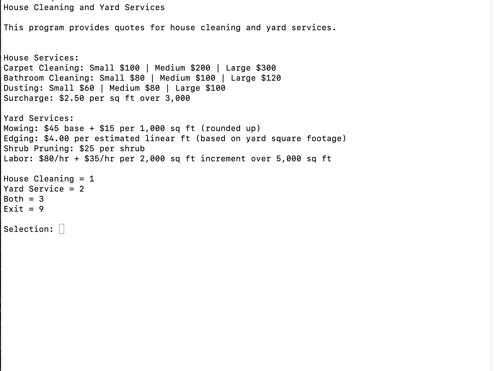
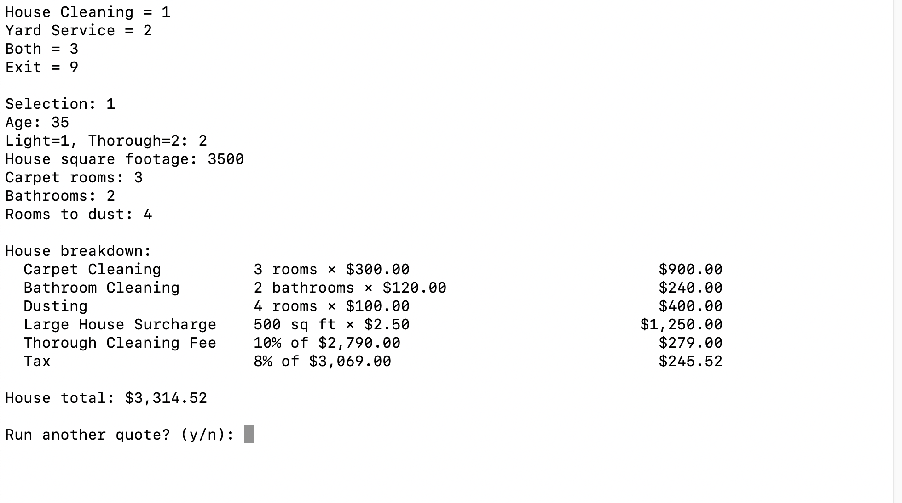
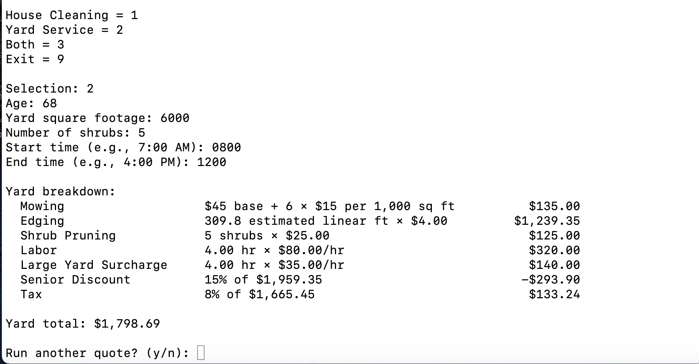
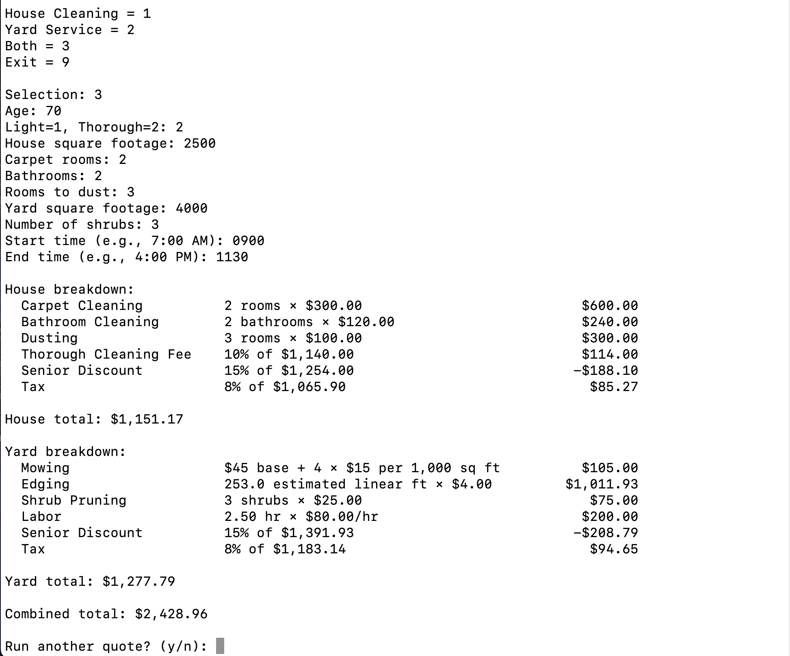
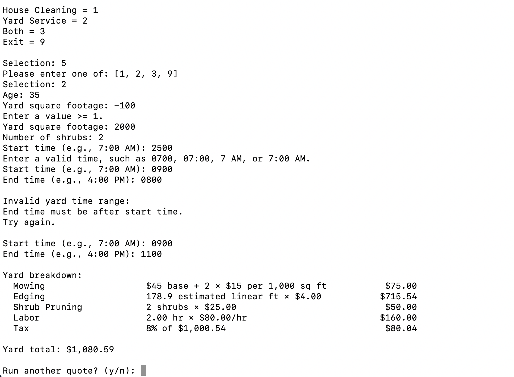

# Application Screenshots

These screenshots demonstrate the Home Services Quote Calculator's command-line interface, quote calculations, and input validation.

## Screenshots

### Main Menu

Displays the available house-cleaning and yard services, pricing information, and service-selection menu.

### House-Cleaning Quote

Demonstrates house-cleaning inputs, itemized charges, the large-property surcharge, thorough-cleaning fees, tax, and the final estimate.

### Yard-Service Quote

Demonstrates yard-service inputs, itemized charges, labor calculations, the large-yard surcharge, a senior discount, tax, and the final estimate.

### Combined Quote

Demonstrates a combined house-cleaning and yard-service estimate, including separate itemized breakdowns and the combined total.

### Input Validation

Demonstrates validation of menu selections, property sizes, time formats, and yard-service time ranges.
